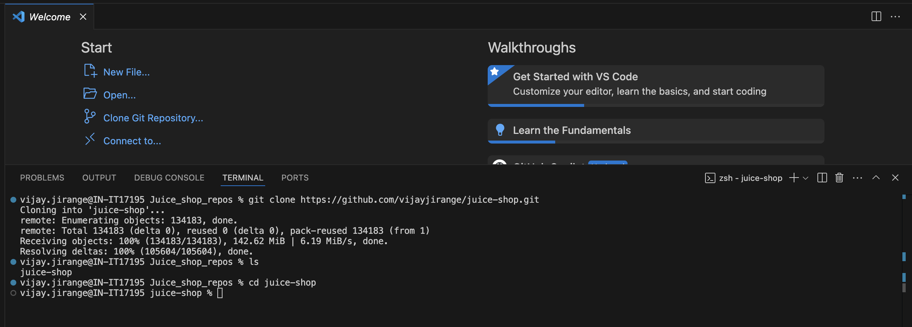
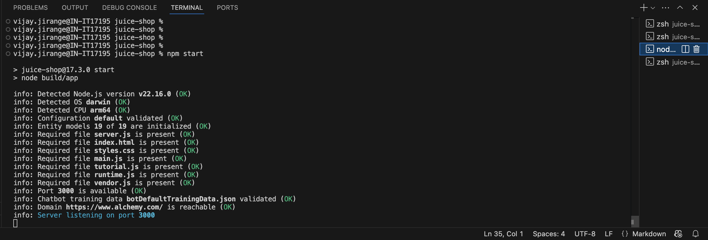
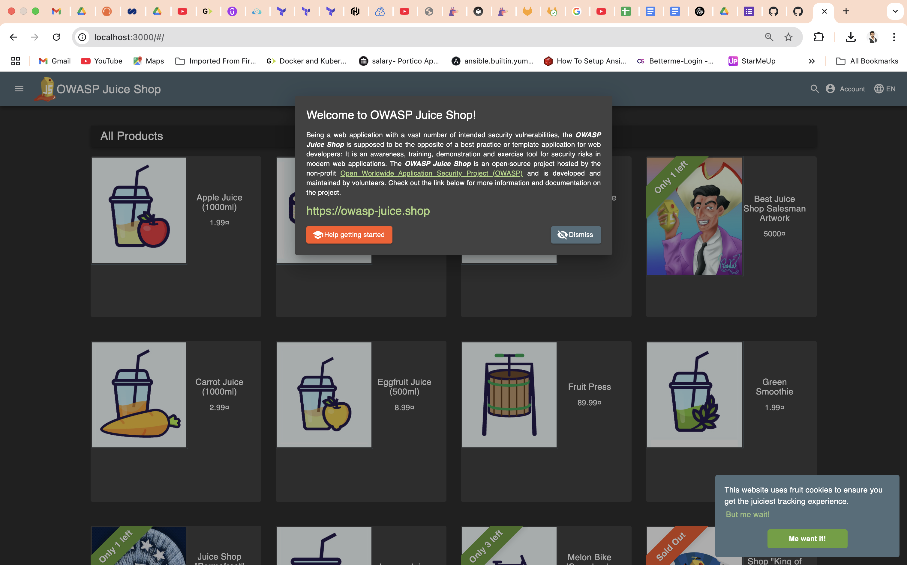
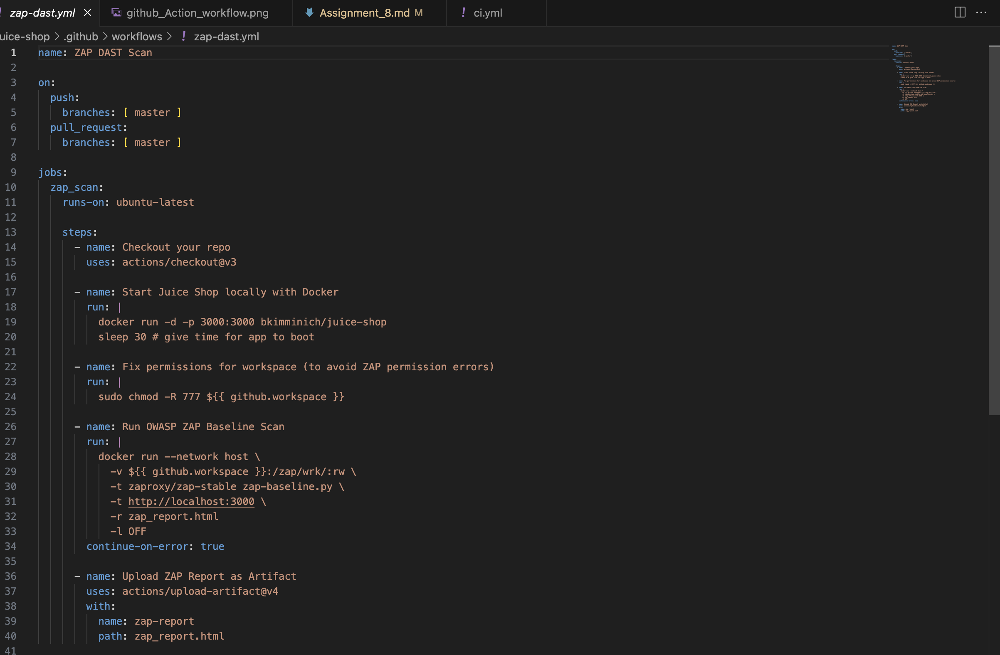
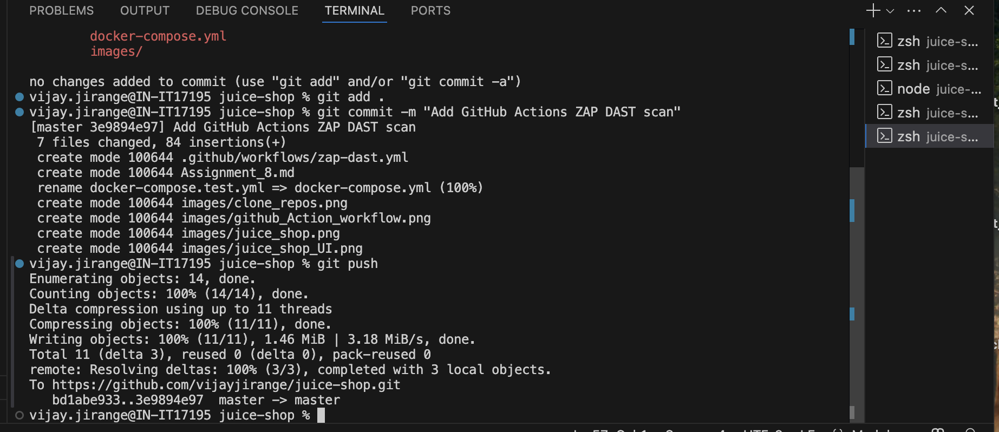
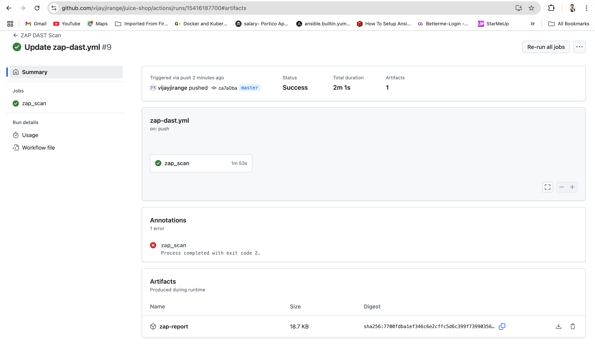
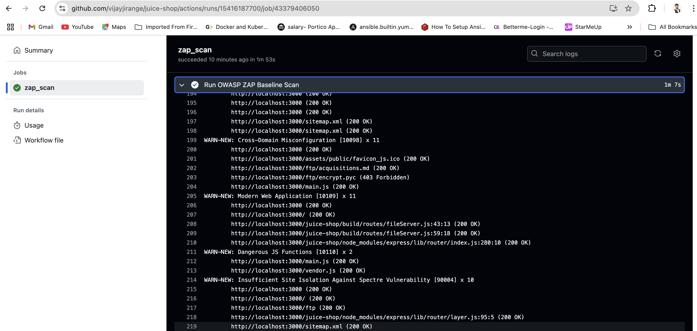
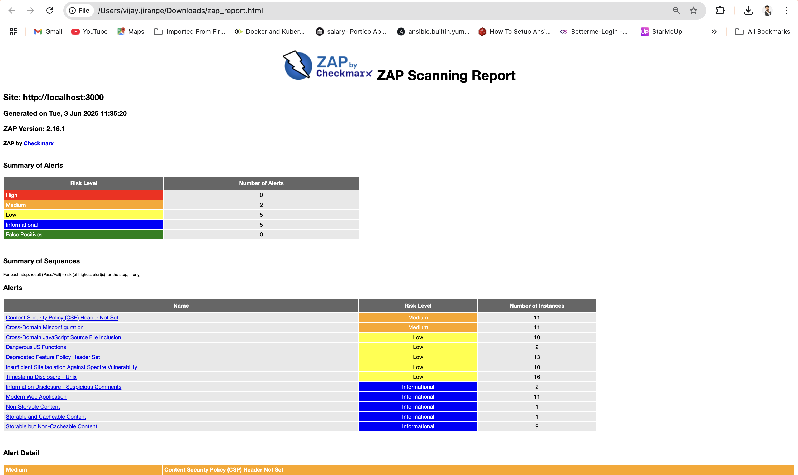

# Apply DAST in Deployment Pipeline

## Objective:
The objective of this POC is to integrate **OWASP ZAP**, an open-source DAST tool, into a deployment pipeline. It allows you to automate the scanning of a web application to identify security vulnerabilities and generate actionable reports.

## How Does It Work?
- **Dynamic Application Security Testing (DAST)** tools work by analyzing a running application from the outside — simulating how an attacker would interact with it — to find security vulnerabilities in real-time.
- DAST is a form of **"Black-box" testing**. It tests an application without access to its source code by sending crafted HTTP requests and analyzing the responses.

## What Does It Help to Detect?

| Vulnerability Type         | Can DAST Detect?       |
|----------------------------|------------------------|
| **SQL Injection**          | ✅ Yes                |
| **XSS (Reflected/Stored)** | ✅ Yes                |
| **Open Redirects**         | ✅ Yes                |
| **Security Headers Missing** | ✅ Yes             |
| **Authentication Weaknesses** | ⚠️ Limited        |
| **CSRF**                   | ⚠️ Sometimes          |
| **Business Logic Flaws**   | ❌ Usually not         |

## Steps to Integrate ZAP in deployment Pipeline

### 1. First Clone Juice-shop Github Repos on Local machine and run it

 - Go into the cloned folder with cd juice-shop
 - Run npm install
 - Run npm start
 - Browse to http://localhost:3000

### 2. Create GitHub Actions Workflow 

- Create a GitHub Actions workflow under `.github/workflows/` with the name `zap-dast.yml`.

### 📝 What This Workflow Does

| Step                        | What It Does                                           |
|-----------------------------|-------------------------------------------------------|
| ✅ **docker run Juice Shop** | Runs the vulnerable app locally in CI.                |
| 🔍 **ZAP Scan**             | Scans the app on `http://localhost:3000` using OWASP ZAP. |
| 📄 **Uploads Report**       | Stores `zap_report.html` so you can download it from the Actions tab. |

### 2. Push the Changes and Check the DAST Report

---

### 3. ✅ View Scan Results

#### - The scan succeeded, and the generated report was uploaded as an artifact.

---

### 📄 Artifact Download URL

You can download the report from the following URL:

[Artifact Download - zap_report.html](https://github.com/vijayjirange/juice-shop/actions/runs/15416861555/artifacts/3249566064)

